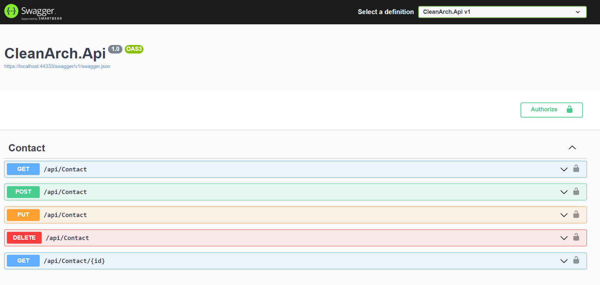
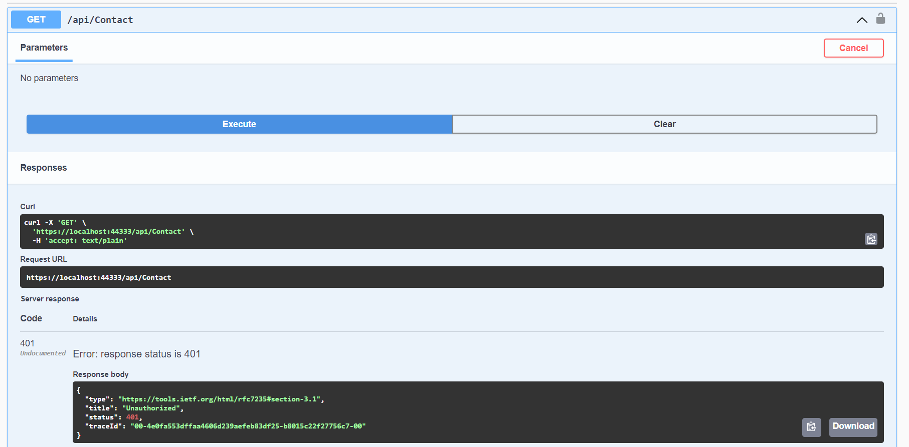
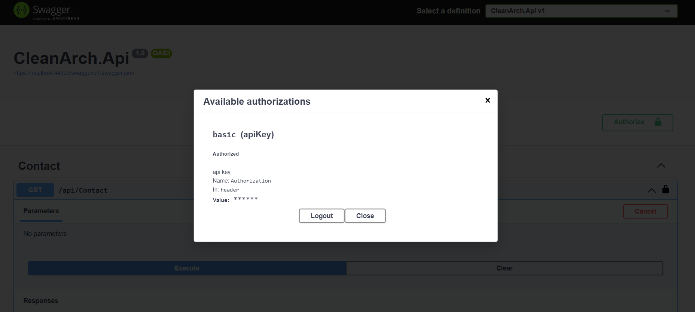
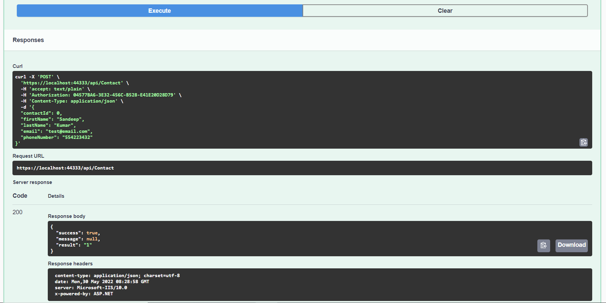
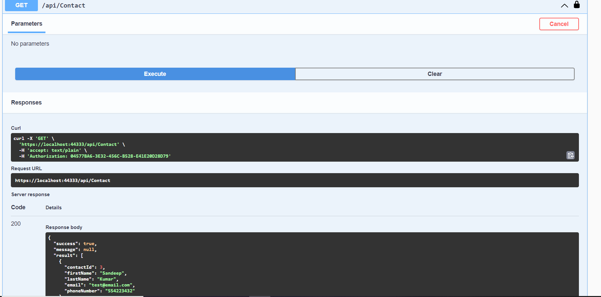
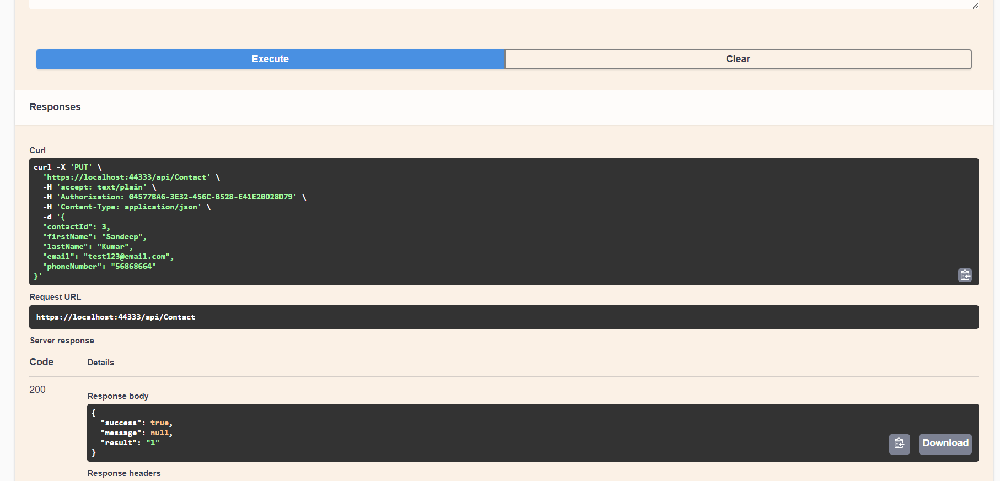
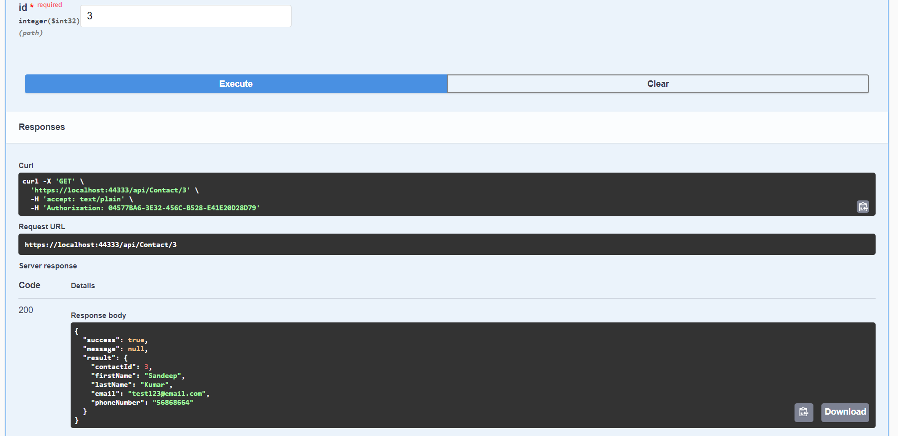
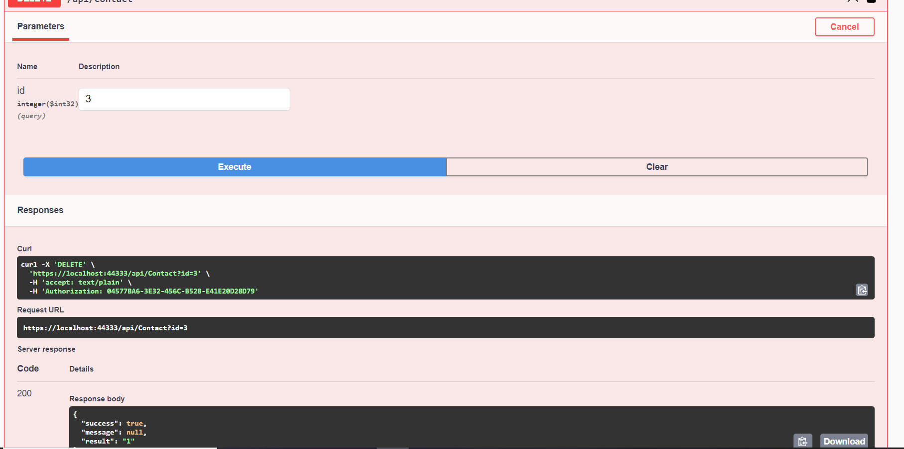

# .NET 8.0 - Clean Architecture using Repository Pattern and Dapper with Logging and Unit Testing #

### Ejecutar SLN en Visual studio 2022 ###

We will use the following tools, technologies, and frameworks in this sample:

- Swagger UI
	

- Running API without authentication throws an error.
	

- agregar API Authorization.
	

- **POST** - Agregar persona.
	

- **GET** - Consultar todas las personas.
	

- **PUT** - Actualizar datos  persona.
	

- **GET** - consultar por id.
	

- **DELETE** - borrar persona.
	

